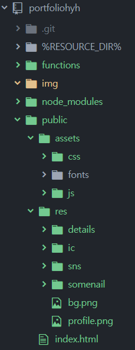

# 포트폴리오 가이드

#### 1. 패키지 구조
 <br><br>
+ ReadMe.md : 설명 페이지 <br>
+ img : 설명 스크린샷 이미지 <br>
+ public : 소스 폴더
+ index.html : 제일 먼저 열리는 디폴트 페이지 <br>
+ assets/css/main.css : index.html을 꾸미는 css파일 <br>
+ assets/js/main.js : 각종 이벤트 제어 <br>
+ res/ic : 카테고리 이미지
+ res/sns : sns 이미지
+ bg.png , profile.png : 배경, 프로필이미지


#### 2. 변경 시 알아야 할 점
변경하고 싶은 부분에 따라 2가지의 경우로 나뉜다.

+ 서버를 다시 배포해야 하는 경우
> 배경, 프로필 이미지<br>
> 이름 , 간단한 소개 <br>
> 경력 , 학력 , 수상 & 사용 툴<br>
> SNS 리스트 <br>
> 카테고리 <br>
> Footer ( 맨 밑글 ) <br>
---> 변경 후 저장한 뒤 서버 배포 <br>

+ 데이터만 바꿔주어도 되는 경우
> 리스트의 각 하나의 아이템 <br>
> ex) 모바일 -> 캐시카우의 타이틀 변경 <br>
> ex) 아이콘 -> gif 추가 <br>
> ex) 영상 -> 유투브 주소 변경 <br>
> <br>
> 주의 ! <br>
> 카테고리의 아이템이 특별한 경우를 가질 경우 개발자와 상담해보세요.<br>


#### 3. 정적 변경 ( 서버 다시 배포 )
+ 배경 , 프로필 이미지 변경<br>
> portfoliohyh/public/res 파일에서 <br>
> bg.png & profile.png 파일을 바꿔준다.

+ 이름 , 간단한소개 , 경력&학력&수상,사용툴 , footer 변경 <br>
> portfoliohyh/public/index.html 파일에서 <br>
> 바꾸고 싶은 곳을 찾아 바꾼다.. <br>

+ sns 리스트 변경 및 추가 <br>
> 이미지 변경 : portfoliohyh/public/res/sns 폴더에서 해당 이미지를 변경한다. <br>
> 링크 변경 : portfoliohyh/public/index.html 파일에서 해당 sns-item를 찾은 후 <br>
> href의 주소값을 변경한다. <br>
> sns 추가 : portfoliohyh/public/res/sns 폴더에 이미지를 추가한다. <br>
> portfoliohyh/public/index.html 파일에서 sns-item가 있는 부분에 아이템 추가한다.<br>

``` html
 <a class="sns-item" href='연결할 링크' class="circle_item"></a></li>
```

+ 카테고리 메뉴 변경 및 추가 <br>
> 카테고리 이미지 변경 : portfoliohyh/public/res/ic 폴더에서 해당 이미지 변경 <br>
> 카테고리 명칭 변경 : portfoliohyh/public/index.html 에서 category 섹션을 찾아 변경 <br>
> 카테고리 메뉴 추가 : portfoliohyh/public/res/ic 폴더에 이미지 추가 후 <br>
> portfoliohyh/public/index.html 에서 category 섹션을 찾아 추가한다. <br>

``` html
<a id="menu"><span> 메뉴</span></a>
```

> 추가 시 갯수에 맞추어 추가 <br>
> portfoliohyh/public/assets/js/main.js 파일에서 setCategoryMenu메소드에 해당 메뉴 클릭이벤트 추가 <br>


#### 4. 동적 변경 ( Firebase에서 Database, store 만 수정 )


#### 5. 기타


#### 6. 도움주신 분
``` java
  String developer = "유종권";
  String deginer = "한영희";

```
